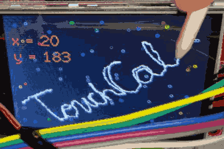
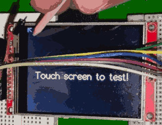

# <i style="display:none;">TOP</i>  
> -----------------------------------------------------------------------------------------------------  
>   [](http://guerratron.github.io/TouchCal "Página TouchCal")  
> '**TouchCal**' (Arduino Library) &emsp;-&emsp; TouchCal Mini-biblioteca para pantallas táctiles SPI (XPT2046_Touchscreen) - by GuerraTron24
> By:  Juan José Guerra Haba - <dinertron@gmail.com> &emsp;-&emsp; Feb, 2023  
> Web:     [GrTron.es][authorWeb] , [GuerraTron.github][authorWeb2]  
> License: Apache + Open GPL v.3. Keep credit, please.   
> Versión: 1.0.0  
> Proyect:    Touch-Screen C++ &emsp; Package: TouchCal.h &emsp; Namespace: tc  
> 
> ----------------------------------------------------------------------------------------------------  

<h3 id="TOC">🏠︎ TOC 🖇️ (Tabla de contenidos)</h3>

- [📋 Introducción](#📋-intro)
- [🔧 Uso](#🔧-uso)
- [✨ Mejoras](#✨-mejoras)
- [⌨️ Preview](#⌨️-preview)
- [💣 Correcciones](#💣-correcciones)
- [🔗 Dependencias](#🔗-dependencias)
- [🌍 Fuentes](#🌍-fuentes)
- [🎁 Agradecimientos](#🎁-agradecimientos)
- [✒️ Sign](#✒️-sign)

<p class="entities" style="display:none;">📋 🔧 ⌨️ ⌨ 🖮  ⚙️ 🚀 📌 ✒️ 🎁  ⎃ ⌂ ☗ 🏠︎ 🏚️ 🏠 ♥ ❤ ❤️ 💖 ★ ⍟ ✨ ⭐ ⭕ 
〽️ ♯ ☑️ ✔️ ✓ ✗ ✖️ ❌ ❗ ❕ ❓ ❔ ⍰ ⯑ 🛈 ⚠ ⚠️ ⚿ ⛔︎ ⛔ 💣 🎈 🔡 🔣
‖ ” „ ƒ ∀ ⌬ ∅ ♖ ♜ 🏆︎ 🏆 🎰 🎮 🎖 🎖️ 🏅
🜉 ⌁ ⭍ 🗲 🗱 ⚡ ⍾ ⏚ ⏛ ⏦ 〰 ♒︎ ☁  ➕ ➖
⌛︎ ⏳︎ ∵ ⛬ 🝆 ⋙ ⭆ ⟹ ⇨ ⊳ ⌲ ➤ ⬀ 🔝 ∭ ↺ ⮔ 🔄 ∾ ∞ ⋈ ♾ ⊕ ⊚ ⌾ 🞇 ⬤ ⏺ ⚫︎ 🞑 🅢 🆂 Ⓢ 🅂 ╬ ⋮ Ξ π ω Ω ⅏ 🀰 🙼 🙾 
⛿ ⚐ ⚑ ⛳︎ 🏳️ 🏴 🏷️ ⚒ 🛠 ⚒️ ⚙ ⛯ ⛓ ⛓️ 🔗 ⛶ ⯐ ✉ ✉️ 📧 🌍︎ 🌍 ✎ ❒ 𝄝 𝄜 🎵 ☺ ☻ ☹ 👤 👦 💥 💤
🜲 🌡 🎚 🎚️ 📷︎ 📷 👁 👁️ 👀 📤︎ 📥︎ 🔓︎ 🔒 🔑 🕨 🕪 🔇 🔈 🔊 🕭 🔔 🔕 🕮 📖 🖋 🖈 📌 📎 📏 🖑 🖫 💾 🗎 📄 🗀 🗁 🗑 🗓 📆 📅 
📟 🗗 🗠 📈 📊 🗩 💬 📦 💯 🔋 🔎</p>
<style>
    blockquote{
        text-align: center;
    }
    .info{
        background:lightBlue;
        color: #333333;
    }
    .alert{
        border-radius: 6px;
        font-size: 0.6em;
        color: blue;
        background: navajoWhite;
        padding: 10px;
    }
    .green{
        color: navy;
        background: lightGreen;
    }
    .preview{
        width: 100%;
        cursor: pointer;
    }
    .mini-preview{
        width: 25%;
        cursor: pointer;
    }
    .bg-SERVICER{
        border-radius: 10px;
        padding: 5px;
        margin: 5px;
        color: lightBlue;
        background: navy;
    }
    .bg-SERVICER>ul>li>i, .bg-FREEDER>ul>li>i{
        background-color: lemonchiffon;
        color: red;
        padding: 0 4px;
        margin-right: 5px;
        line-height: 1.3em;
    }
    .bg-FREEDER{
        border-radius: 10px;
        padding: 5px;
        margin: 5px;
        color: lime;
        background: darkgreen;
    }
    .float-left{
        float: left;
    }
    .clearfix{
        clear: both;
    }
    .small{
        font-size: x-small;
        color: gray;
    }
    h1{
        text-align:center;
    }
    h2>span{
        float:left;
    }
</style>

#  TouchCal v1.0 <span class="small">by [GuerraTron-24][authorEmail]</span>

## 📋-Intro

 Mini-biblioteca para pantallas táctiles SPI (necesita XPT2046_Touchscreen).

 Tiene utilidades para la TouchScreen como la calibración de la pantalla, comprobar toque válido en función de la presión, 
 figuras lissajous para comprobar la simetría de la screen, e incluso "Modo-Oscuro" sin display ..  
 
 > Basado en los ejemplos de la librería **TFT_eSPI** de *bodmer*; utiliza **XPT2046_Touchscreen** de *Paul Stoffregen*.
 [QUE PEDAZO UTILIDADES]. 
 
 Aunque es más visual y estético la utilización de un display, en realidad existen proyectos donde no son imprescindibles. Por eso esta 
 biblioteca NO tiene DEPENDENCIA  DIRECTA con "TFT_eSPI", se puede trabajar sin esa "maravillosa utilidad" (pero sí con "XPT2046_Touchscreen"). 

 Esta mini-librería surge de la necesidad de obtener parámetros de configuración de la pantalla de toque a raiz de 
 algunos experimentos en los que me fallaba la función original TFT_eSPI::calibrateTouch(..), se quedaba colgado el 
 dispositivo con ciertas configuraciones de pantalla, pines y SPI.

 La función de calibración la he puesto más visual aunque se incremente el costo computacional, ya que se supone que 
 no es una librería de usuario a la usanza, más bien una herramienta para el programador que cuando termine la depuración 
 seguramente la inhiba.


## 🔧-Uso

 La función principal sería *"calibration(..)"* que admite como parámetros (PUNTEROS) la touchscreen y la screen (si está disponible), 
 además de colores y tamaños para las flechas de las esquinas (al igual que *"TFT_eSPI::calibrateTouch(..)"*). 
 La función realiza las mismas comprobaciones que la original más algunos añadidos extra, pero se basa en el objeto *touchscreen* 
 pasado como parámetro y que se supone que ya se encuentra iniciado para detectar los toques, en vez del objeto por defecto que 
 ataca la librería original.  

 > Así, con esta librería NO IMPORTA en qué pines se conecte la pantalla táctil, ni que tipo de *SPI* utilice, ya que esto viene 
 > establecido con aterioridad a la utilización de esta librería. 

 El parámetro de la screen (TFT_eSPI \*tft) se utiliza para dar visualización a las indicaciones y los datos leídos, aunque no 
 es imprescindible ya que esos mismos datos se están mandando en paralelo al monitor serie *(qué curiosa expresion, "paralelo-serie"!)*, 
 he incluso pueden optenerse en tiempo de ejecución a través del array global ``` TC_PARS\[5\] ```.  

 Lo que sí necesita son las dimensiones de la pantalla: *TFT_HEIGHT* y *TFT_WIDTH*, y los colores predefinidos, además de la rotación 
 *TC_ROTATION*; en función de esta rotación los valores de "width" y "height" se invertirán.
 
  - **FULL-MODE**: Utilizar por ejemplo: ``` tc::calibration(&ts, &tft); ``` 
  Un uso normal sería su utilización en el "setup" después de haber inicializado el resto de librerías *"Serial, TFT_eSPI, XPT2046_Touchscreen"* 
  necesarias; o por ejemplo también en un *"handler"* de algún botón de acción.

  - **DARK-MODE**: Un uso simplificado pordría ser utilizando únicamente la "touchscreen" (sin screen) para lo cual habría que definir 
 previamente algunas definiciones utilizadas por la librería *"TFT_eSPI"* (dimensiones y colores), entonces se reduciría a:
 ``` tc::calibration(&ts); ```
 
  - **PIN-MODE**: Otro modo de trabajo (*EXTREMO*), sin display ni puerto Serial, podría implementarse informando a través de un *LED* conectado al pin definido en 
 *PIN_PRINT*, por defecto el 26 en ESP32. Esta forma es muy arcaica pero serviría para identificar los toques en las esquinas en función 
 del parpadeo del *LED* (corner1 = 1, corner2 = 2, ..) y sólo necesitaríamos la parte táctil de la pantalla. A partir de aquí ya estaría 
 calibrada la táctil, pero claro, cada vez que iniciemos habría que recalibrarla de nuevo.

 ATENCIÓN: Definir la rotación a utilizar con la screen y la touch en *TC_ROTATION* (del 0 al 3)
 

## ✨-Mejoras
Se preveen futuras mejoras en versiones posteriores, quizás se añadan más drivers y compatibilidad con más pantallas, nuevas funciones, quizás cambio de *namespace* a *class*, 
separación en archivos fuentes y cabecera, ...
 
 Sólo se ha probado en una placa con **ESP32** (*DOIT ESP32 DevKIT v1*) y con una *TFT-SPI 3.2" - 240x320*
 
## ⌨️-Preview


<blockquote>

</blockquote>

## 💣-Correcciones
TODO: Mejora y Refactoriación del código, corrección de errores, ..
SE HA IMPLEMENTADO TODO EN UN ÚNICO ARCHIVO DE CABECERA ".H" POR NUMEROSOS PROBLEMAS EN EL "LINKER" AL SEPARARLO EN ARCHIVOS ".cpp"

## 🔗-Dependencias
Tiene dependencia directa con **"XPT2046_Touchscreen"**  
Aunque NO tiene DEPENDENCIA DIRECTA con *"TFT_eSPI"* (se puede trabajar sin esa "maravillosa utilidad") la verdad es que la experiencia mejora bastante con ella.

### 🌍-Fuentes
[TFT_eSPI](https://github.com/Bodmer/TFT_eSPI) de *Bodmer*,  
[XPT2046_Touchscreen](https://github.com/PaulStoffregen/XPT2046_Touchscreen) de *Paul Stoffregen*,  
https://forum.arduino.cc/, ..

### 🎁-Agradecimientos
Muchas gracias a todos los que hacen código libre por desarrollar herramientas superútiles para todos; esta vez también a Microsoft por su <abbr title="Visual Studio Code">VSC</abbr>, sin esta herramienta habría sido imposible la creación de la API  
.. y en general a todo el mundo altruista que genera código y lo dispone open-source. También al mundo de **Arduino** y el open-hardware.  

## ✒️-Sign:
Disfruten de su uso. Espero que a alguien le resulte tan útil como a mí.
2024 -  [GuerraTron-24][authorEmail] &reg; [GuerraTron Github][authorWeb2]

---
⌨️ con ❤️ por [Juan José Guerra][GuerraTron-Github] 😊

[<b style="font-size:xx-large; margin-left:50%;">🔝</b>](#top)

<!-- REFERENCIAS -->
[authorEmail]: mailto:dinertron@gmail.com  
[authorWeb]: https://grtron.es/ "Desarrollo web + app"  
[authorWeb2]: https://guerratron.github.io/  
[GuerraTron-Github]: https://github.com/guerratron/  
